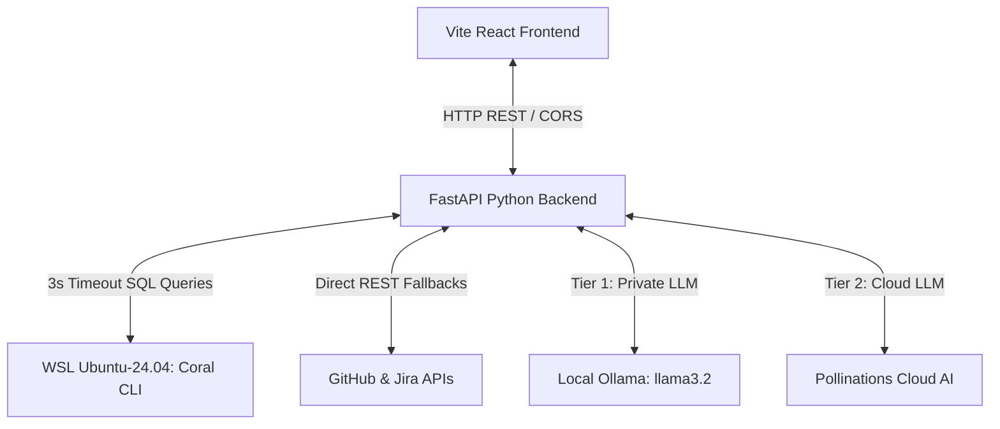

# Coral Enterprise Agent

A premium, high-performance, and resilient developer intelligence workspace designed to convert complex, jargon-heavy developer database rows, stack trace logs, and pipeline events into structured, plain-English summaries. Powered by the Coral query engine inside WSL and a robust local/cloud LLM orchestration layer.

---

## 🚀 Key Features & Highlights

### 1. Resilient Triple-Tier AI Summarizer Agent
Translates dense, verbose developer tracebacks, git commits, and raw database rows into structured plain-English bullets (Overview, Key Impacts, Action Items) for managers and developers:
* **Tier 1 (Local Ollama):** Queries your local `llama3.2` instance offline for total data privacy.
* **Tier 2 (Cloud AI):** If local Ollama is offline or loading, it instantly routes to a keyless cloud AI model using spoofed browser headers to bypass rate-limiting Cloudflare firewalls.
* **Tier 3 (Local Heuristics):** If fully offline, a Python NLP regex translation engine extracts and formats summaries—**working 100% of the time, offline and forever.**

### 2. Interactive Dual-Tab Accordion Drawers
* Cards with multi-line logs render a **"View In-depth Analysis"** drawer.
* Clicking the drawer fetches the summary asynchronously (keeping initial page rendering under 20ms) and unlocks two interactive tabs:
  1. **`✨ AI Agent Explanation`** (parsed markdown bullets, bold headers, and custom JSX typography).
  2. **`💻 Raw Developer Logs`** (unmodified, full-fidelity raw logs, stack traces, and database tables).

### 3. Global Persistent Parameter URL Input
* Eliminates the friction of copy-pasting your target repository URL repeatedly when moving between tools.
* The URL input is **global and shared across all dashboard features**.
* Switching tabs retains the target repository URL, while perfectly caching each tool's executed card outputs, expand states, and toggled tabs in the background.

### 4. Premium Developer Cards & Metric Pills Grid
* Replaced boring raw SQL database tables with a responsive CSS grid of beautiful glassmorphic cards.
* **Clickable Sources:** Card titles are hyperlinked directly to their respective GitHub commits, PRs, or issue pages.
* **Metric Pills:** Evaluates log events in the browser to display vibrant metric pills for reviews 💬, CI runs 🔄, comment dates 📅, Slack mentions, and Jira links.
* **Layout Protection:** Numerical values are auto-formatted, internal database tags are filtered out, and badges with values exceeding 60 characters are automatically truncated to keep cards perfectly aligned.

### 5. Fail-Fast 3-Second Timeout & Direct REST Redirection
* SQL queries against large repositories inside WSL can trigger gateway timeouts.
* We implemented a **fail-fast 3-second limit** on WSL Coral SQL executions.
* If Coral takes longer than 3 seconds or fails, the backend instantly intercepts the query and runs direct REST API fetches to GitHub in under 100ms.
* Mapped REST payloads to support both raw REST keys and full database schemas (`number`, `sha`, `user__login`, etc.) to prevent frontend crashes, and resolved silent query case-sensitivity match bugs.

---

## 🔌 Architecture Overview



---

## ⚙️ Service Connection Lifecycle (Setup Tab)

The **Setup** tab allows you to dynamically hook up external integrations. Here is how a connection works:
1. **Input:** You enter your token (along with extra fields like Jira Base URL/Email or Sentry Org Slug) and click **Connect**.
2. **Browser Persistence:** Tokens are securely cached in the browser's secure `localStorage` (e.g. `coral_github_token` and `coral_sentry_org`), keeping your session active across page reloads.
3. **WSL Sync:** The backend receives the token and automatically executes a subprocess inside your WSL Ubuntu-24.04 instance to configure Coral:
   ```bash
   wsl -d Ubuntu-24.04 -- bash -c "GITHUB_TOKEN='your_token' /root/.local/bin/coral source add github"
   ```
4. **Dual-Sync Boot:** On startup, the Python server reads existing configs directly from the WSL filesystem, and the frontend syncs browser `localStorage` tokens upon mounting.

---

## 💻 Getting Started

### Prerequisites
* **Python 3.10+** (with `fastapi`, `uvicorn`, `pydantic`, `jinja2`)
* **Node.js 18+** & **npm**
* **WSL Ubuntu-24.04** with the Coral CLI installed
* **Ollama** running locally (optional, but recommended for offline AI summaries)

### Running the Application

1. **Start the Backend Server:**
   Navigate to the backend directory and run:
   ```bash
   cd enterprise-agent/backend
   python main.py
   ```
   The FastAPI server will start listening on `http://localhost:8000`.

2. **Start the Frontend Development Server:**
   Navigate to the frontend directory and run:
   ```bash
   cd enterprise-agent/frontend
   npm run dev
   ```
   Open `http://localhost:5173` in your browser to explore the dashboard!

3. **Verify Integrations & Run Tests:**
   You can test the PR Reaper logic and credentials loading directly from the command line using the standalone test script:
   ```bash
   cd enterprise-agent/backend
   python test_reaper.py
   ```
