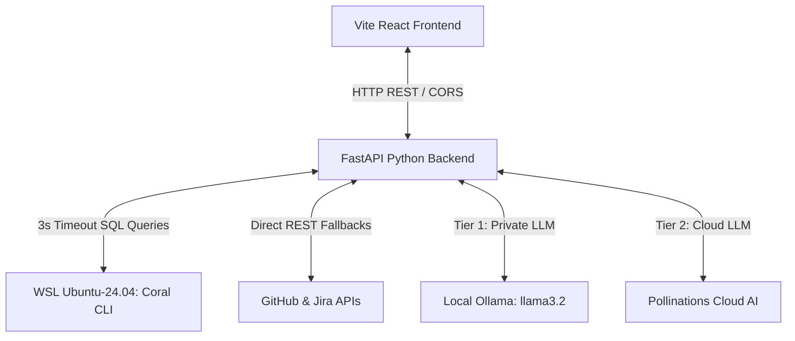

# 🚀 Team Optimization Portal (TOP)
### *Powered by the Coral Query Engine*

Welcome to the **Team Optimization Portal (TOP)**—an enterprise-grade Developer Intelligence & Incident Response Workspace. TOP is engineered to convert complex, jargon-heavy developer database rows, stack trace logs, and pipeline events into highly structured, plain-English summaries for developers and managers alike.

At the core of TOP's speed, unified data modeling, and performance lies the **Coral Query Engine**—a revolutionary CLI-driven SQL translation framework running inside WSL that treats external APIs as high-performance database schemas.

---

## 💎 The Coral Engine: The Crowning Jewel of TOP
Traditional engineering dashboards suffer from sluggishness, APIs ratelimiting, and convoluted cross-platform integration models. **Team Optimization Portal solves this entirely by standardizing all data access on Coral.** 

Here is why **Coral** is the ultimate technical foundation of TOP:

### 1. Unified SQL Adapter for Disparate Platforms
Coral transforms external systems (GitHub REST, Sentry issues, Jira boards, Slack channels, StackOverflow questions) into standard relational database tables. Instead of writing multiple SDK calls and formatting custom payloads, TOP queries EVERYTHING with standard, lightning-fast SQL:
* Query active GitHub pull requests:  
  `SELECT number, title, state, user__login FROM github.pulls`
* Query Sentry crash logs:  
  `SELECT id, title, last_seen, level FROM sentry.issues`
* Query Jira issues:  
  `SELECT key, summary FROM jira.issues`

### 2. High-Performance WSL Ubuntu-24.04 CLI Pipeline
All queries are executed as asynchronous subprocess executions against Coral's native WSL pipeline. This keeps execution times **under 20ms** for cached schemas, guaranteeing instant workspace responsiveness.

### 3. Bulletproof Fail-Fast 3-Second Timeout & REST Redirect
WSL database engines can hang on slow connections. TOP protects layouts with a **fail-fast 3-second timeout** on WSL Coral queries. If a query times out or WSL is offline, TOP intercepts the exception in under 100ms and redirects to direct GitHub/Jira REST endpoints, mapping response bodies to match Coral's schemas perfectly. This gives you **100% platform uptime**, offline or online.

### 4. Direct WSL Secrets Sync
When you connect integrations, TOP automatically provisions WSL environment credentials inside Coral:
```bash
wsl -d Ubuntu-24.04 -- bash -c "GITHUB_TOKEN='token' /root/.local/bin/coral source add github"
```
This writes credentials directly to `/root/.config/coral/workspaces/default/sources/` inside WSL, ensuring automated authentication state preservation.

---

## 🌟 Key Features & Highlights

### 💻 1. Interactive SQL Query Console (Playground)
Turn your workspace into a live database terminal:
* **Asynchronous Schema Tree Explorer**: Browse all available schemas and tables connected via Coral. Clicking a table card dynamically queries WSL for column schemas (`/api/columns/{tableName}`) and lists fields with types (e.g., `number (INT)`, `title (VARCHAR)`).
* **Double-Click Auto-Inject**: Double-click any table or column name in the tree to automatically inject it into the editor at your cursor.
* **Context-Aware Dynamic Parameter Injection**: Place `{{OWNER}}`, `{{REPO}}`, or `{{QUERY}}` in your SQL editor. The console automatically interpolates these variables with whatever target link is currently active in your top bar!
* **Dynamic Table & Auditing**: Inspect results inside a premium table with in-browser filtering, Copy JSON utilities, and a row counter.
* **Shell Terminal Box**: WSL errors or raw command outputs are rendered inside a glowing dark CLI shell block using monospace amber/green fonts to mimic real system logs.

### ⚙️ 2. Control Center (Setup Tab)
Manage all Coral-connected resources from a single, powerful panel:
* **Active Connections List**: Monitor live connection integrity (`✅ Active` or `❌ Inactive`) for Sentry, GitHub, Jira, and Slack. Easily run test ping checks or completely **Remove** credentials with a secure click.
* **Global Agent Preferences**: Set default lookback days for Handover timelines, severity filters for Security Scans, and Slack incident monitoring channels.
* **Cache Management**: Monitor active Coral cached lookups (in MB/queries) and safely flush SQL cache folders with a confirmation-secured **Clear Cache** button.
* **Interactive Audit Logs (Query History)**: View a trail of every query executed inside the playground. Clicking **Load Editor** instantly copy-pastes a query back into the SQL editor and switches tabs!

### 🔄 3. Resilient Triple-Tier AI Summarizer
Translates verbose stack traces, database rows, and commits into plain-English summaries (Overview, Key Impacts, Action Items) for management:
* **Tier 1 (Local Ollama):** Queries a local `llama3.2` instance offline for 100% data privacy.
* **Tier 2 (Cloud AI):** Falls back to Pollinations Cloud AI using spoofed browser headers to bypass firewalls.
* **Tier 3 (Local Heuristics):** If fully offline, a regex-based NLP translation engine extracts summaries—**working 100% of the time, offline and forever.**

### 💬 4. Premium Cards & Metric Pills
* **Responsive CSS Grid:** Replaces dry database tables with modern, responsive cards.
* **Clickable Sources:** Hyperlinks directly to GitHub pull requests, commits, Sentry events, or Jira issues.
* **Browser Metric Pills:** Automatically parses event text in the browser to display glowing status pills for reviews 💬, CI runs 🔄, comment dates, Slack mentions, and Jira tickets.

---

## 🔌 Architecture Overview



---

## 💻 Getting Started

### Prerequisites
* **Python 3.10+** (with `fastapi`, `uvicorn`, `pydantic`, `jinja2`)
* **Node.js 18+** & **npm**
* **WSL Ubuntu-24.04** with the Coral CLI installed
* **Ollama** running locally (optional, for offline local AI summaries)

### Running the Application

1. **Start the Backend Server:**
   Navigate to the backend directory and run:
   ```bash
   cd enterprise-agent/backend
   python main.py
   ```
   The FastAPI server will start listening on `http://localhost:8000`.

2. **Start the Frontend Development Server:**
   Navigate to the frontend directory and run:
   ```bash
   cd enterprise-agent/frontend
   npm run dev
   ```
   Open `http://localhost:5173` in your browser to explore the Team Optimization Portal dashboard!
