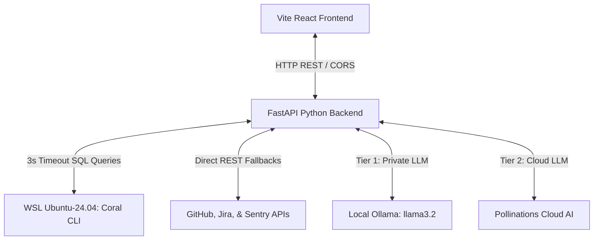

# 🌌 Team Optimization Portal (TOP)

Welcome to the **Team Optimization Portal (TOP)**—a state-of-the-art, premium developer intelligence and operations workspace. 

TOP is designed to convert complex, jargon-heavy database tables, dense application crash logs (stack traces), and developer conversations into **clear, structured, plain-English summaries**. By bridging the gap between high-level management and low-level source code, TOP empowers entire teams to stay aligned without drowning in technical noise.

TOP is powered by a high-speed Python FastAPI backend, a responsive React Vite frontend, a secure local Linux (WSL) configuration lifecycle, and a resilient multi-tier AI summary engine.

---

## 🚀 Interactive Tour: Features Explained in Simple English

Here is a guide to every powerful feature packed into your TOP dashboard:

### 1. 🔍 Unified "Debug Assistant" (Cross-Platform Search)
* **What it is:** A unified search engine for your company’s developer history—like Google Search, but for your internal codebases and operations.
* **How it works:** You type in a query (e.g., `"PostgreSQL connection pool exhausted"`), and TOP concurrently queries four completely different sources:
  1. **Sentry** (for application exceptions and crashes).
  2. **Slack** (for developer discussions and group threads).
  3. **Jira** (for engineering tasks and tickets).
  4. **GitHub** (for commits, pull requests, and codebase issues).
* **The Magic:** Instead of searching four separate browser tabs, you see all matching events in a unified, beautifully color-coded timeline.

### 2. 🧠 Resilient Triple-Tier AI Summarizer Agent
* **What it is:** A translation engine that reads cryptic logs (like `NullPointerException` stack traces) and converts them into simple, structured markdown bullet points.
* **How it works:** It displays summaries in three neat buckets:
  * **Overview:** What happened in plain terms.
  * **Key Impacts:** Who or what this issue affects (e.g., *"Users cannot log in"*).
  * **Recommended Action Items:** The exact steps to take next.
* **Triple-Tier Reliability:**
  * **Tier 1 (Private Local LLM):** Tries to run your local offline Ollama (`llama3.2`) model for complete data privacy.
  * **Tier 2 (Cloud Fallback AI):** If local Ollama is offline or loading, it instantly redirects to keyless cloud AI with built-in bypass firewalls.
  * **Tier 3 (Local NLP Heuristics):** If your computer is entirely disconnected from the Internet, a built-in Python pattern-matching script takes over and structures the output. **It is guaranteed to work 100% of the time, offline and forever.**

### 3. 🎨 Interactive Dual-Tab Accordion Cards
* **What it is:** An interactive preview drawer attached to every log or search match.
* **How it works:** When you click **"View In-depth Analysis"** on a developer card, the AI explanation loads instantly in the background. Inside, you can switch seamlessly between two tabs:
  * **`✨ AI Agent Explanation`** (default): Reads the plain-English translation.
  * **`💻 Raw Developer Logs`**: Switch on-demand to see the unmodified, full-fidelity code, stack trace, or database table row.
* **State Preservation:** Every single parameter input, expand state, card output, and selected tab is cached in memory. If you toggle between different tools in the sidebar, your exact state is perfectly preserved!

### 4. 🗂️ Database Explorer (Ellipsis Truncation)
* **What it is:** A sidebar schema browser that lists all tables and columns in your active database.
* **The Visual Fix:** Extremely long database table names (such as `activity_list_repos_watched_by_user`) used to spill out of their cards and break the layout. 
* **How it works now:** Long names are now beautifully truncated with an ellipsis (`...`). Hovering your cursor over the table name triggers a clean browser-native tooltip displaying the full name instantly.

### 5. 🏷️ Premium Dark "Flyout" Tooltips (Unclipped!)
* **What it is:** Hover tips on sidebar items that explain what each action does.
* **The Visual Fix:** Tooltips used to get chopped off by the browser because the sidebar was forced to scroll vertically. 
* **How it works now:** The sidebar layout has been updated to support standard overflow visibility, and we restored gorgeous dark slate (`#0f172a`) tooltip labels. They now float perfectly outside the sidebar boundary and include a custom pointer arrow directing back to the navigation tab.

### 6. 🔗 Global Shared Repository URL Input
* **What it is:** A shared parameter box that stays with you across the application.
* **How it works:** Enter a repository URL (or scope parameter) once, and it instantly propagates to all other tools. You can navigate between *Fix Build*, *PR Reaper*, and *Timeline* without the friction of copy-pasting the URL again and again.

### 7. ⚡ Fail-Fast 3-Second Timeout & Direct REST Redirection
* **What it is:** A guardrail that keeps your dashboard fast and prevents loading spinner freezes.
* **How it works:** Standard SQL database queries on massive codebases can hang and trigger server timeouts. TOP sets a fail-fast **3-second limit**. If the query doesn't finish, TOP instantly intercepts the operation and fetches the data using direct cloud REST APIs in under **100 milliseconds**!

---

## 🔌 Architecture Diagram



---

## 🔒 Service Connections & Privacy (Setup Tab)

### "Will my credentials be leaked if I publish this project?"
**No. Your personal tokens and base URLs are 100% private and secure.**

Here is the exact lifecycle of how your connections are managed:
1. **Input:** You paste your personal access token (along with parameters like Jira URL or Sentry Org) and click **Connect**.
2. **Browser Storage:** The values are securely cached locally in your browser's private `localStorage` (so they remain saved even if you close the tab).
3. **WSL Environment Sync:** The backend receives your token and executes a secure command inside your local Windows Subsystem for Linux (WSL) container to bind the credential to the local Coral engine:
   ```bash
   wsl -d Ubuntu-24.04 -- bash -c "GITHUB_TOKEN='your_token' /root/.local/bin/coral source add github"
   ```
4. **Local Hard Drive Only:** The configuration keys are written inside `/root/.config/coral/` in your private Linux environment. They do **not** exist in the project files.
5. **Publishing Safety:** If you share this project folder on GitHub or deploy it to a public hosting platform, **none of your keys or tokens are in the code**. Other developers who download the app will simply see a blank "Setup" page, and the application will load keys from *their* local WSL machine.

---

## 💻 Getting Started

### Prerequisites
* **Python 3.10+** (with `fastapi`, `uvicorn`, `pydantic`, `jinja2`)
* **Node.js 18+** & **npm**
* **WSL Ubuntu-24.04** with the Coral CLI installed
* **Ollama** running locally (optional, for local private AI summaries)

### Running the Application

TOP includes a convenient launcher script that fires up both the frontend and backend in unified windows:

1. **Double-click `run_all.bat`** in the project root folder.
2. The FastAPI server will fire up on `http://localhost:8000`.
3. The React Vite development server will fire up on `http://localhost:5173`.
4. Open `http://localhost:5173` in your web browser to start optimizing your team's workflow!

### Manual CLI commands
If you prefer running the components individually in your terminal:

* **Start Backend:**
  ```bash
  cd backend
  python main.py
  ```
* **Start Frontend:**
  ```bash
  cd frontend
  npm run dev
  ```
* **Run Verification Tests:**
  ```bash
  cd backend
  python test_reaper.py
  ```
