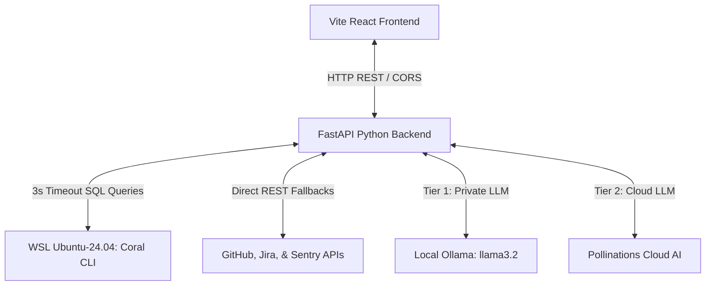

# 🌌 Team Optimization Portal (TOP)

Welcome to the **Team Optimization Portal (TOP)**—a state-of-the-art, premium developer intelligence and operations workspace. 

TOP is designed to convert complex, jargon-heavy database tables, dense application crash logs (stack traces), and developer conversations into **clear, structured, plain-English summaries**. By bridging the gap between high-level management and low-level source code, TOP empowers entire teams to stay aligned, track bottlenecks, resolve build issues, and search company history without drowning in technical noise.

TOP is powered by a high-speed Python FastAPI backend, a responsive React Vite frontend, a secure local Linux (WSL) configuration lifecycle, and a resilient multi-tier AI summary engine.

---

## 🛠️ The TOP Core Workspace: 4 Primary Views

TOP divides your workspace into four dedicated developer panels located in the top section of the sidebar:

### 1. 📊 Dashboard
* **What it is:** The primary cockpit of the portal.
* **How it works:** This is where you run any of the 13 specialized developer tools. Simply select a tool from the bottom sidebar, enter a target repository URL in the global parameter bar, and execute.
* **The Output:** It compiles data into premium, responsive grid cards featuring in-browser metrics, dynamic status badges, and asynchronous AI drawers.

### 2. 💻 Query Console
* **What it is:** A live SQL query playground.
* **How it works:** Allows developers to write and run raw, custom SQL queries against their entire GitHub (commits, pulls, action runs), Jira, and Sentry databases.
* **Special Features:** 
  * Features the **Coral Schema Tree** sidebar detailing tables and columns with layout ellipsis and hover titles.
  * Includes a grid of **Preset SQL templates** (like *Recent GitHub PRs*, *Sentry Crash Events*, *Latest Action Runs*) to run instant queries in one click.

### 3. 🔍 Debug Assistant
* **What it is:** A unified search engine for your company’s developer history—like Google Search, but for your internal codebases and operations.
* **How it works:** You type in a query (e.g., `"PostgreSQL connection pool exhausted"`), and TOP concurrently queries Sentry, Slack, Jira, and GitHub.
* **The Magic:** Aggregates exceptions, group discussions, open tasks, and codebase pull requests into a unified, beautifully color-coded company timeline.

### 4. ⚙️ Setup
* **What it is:** The secure integrations manager.
* **How it works:** Connects your corporate GitHub, Jira, and Sentry accounts. Entered keys are saved locally inside your private Linux (WSL) container environment and browser `localStorage`, ensuring complete safety.

---

## 🚀 The Available Tools Suite: 13 Premium Developer Tools

At the bottom of the sidebar is your specialized developer toolkit. Every tool runs customized, high-performance database queries and passes payloads through the AI summary agent. Here is what every tool does:

### 1. ⚡ Fix Build
* **Goal:** Scans CI/CD pipeline runs to find build and test failures in real-time.
* **Mechanism:** Queries `github.repo_action_runs` inside your repository to isolate failed steps and error tracebacks.
* **Value:** Renders beautiful cards showing run numbers, triggering events, and workflow durations, offering an AI explanation detailing *which file broke* and *how to fix it*.

### 2. 🧹 Cleanup PRs
* **Goal:** Scans open pull requests to highlight stagnancy, blocked status, or missing approvals.
* **Mechanism:** Queries open PRs and reviewer states concurrently to identify branches inactive for over 14 days or waiting on code owners.
* **Value:** Shows peer reviews, review comments 💬, approved checkmarks ✅, and outputs clear block callouts to help team leads release code fast.

### 3. 📝 Handover
* **Goal:** Automatically generates milestone summaries and shift handoff documentation.
* **Mechanism:** Gathers your git commits, closed issues, and pull request changesets for a target repository within the active timeline.
* **Value:** Generates professional markdown reports broken into *Summary of Accomplishments*, *Key Technical Changes*, and *Next Steps*.

### 4. 🛡️ Security Scan
* **Goal:** Audits your codebase commits for known security vulnerabilities or hardcoded secrets.
* **Mechanism:** Queries database commits (`github.commits`) searching recent histories against key vulnerability triggers.
* **Value:** Displays audit cards showing authors, commit timestamps, and direct codebase links to flag potential breaches.

### 5. 🔍 Enrich Ticket
* **Goal:** Triages vague, sparse user bug reports by matching them with code telemetry.
* **Mechanism:** Interlinks open repository issues with underlying stack trace histories and crash timelines.
* **Value:** Automatically adds stack trace logs, error context, and file details to bug reports, letting developers fix them in minutes.

### 6. 🔌 Upgrade Check
* **Goal:** Audits merged and active dependency upgrade pull requests.
* **Mechanism:** Scans PRs targeting main bases (`main` or `master`) specifically searching for library upgrades.
* **Value:** Highlights library versions, packages, and check statuses to ensure dependency bumps compile safely and won't crash production.

### 7. 👥 Who Owns?
* **Goal:** Identifies the best engineering expert to ask questions about a repository or folder.
* **Mechanism:** Aggregates git commit logs over the past 90 days and groups contributions by author.
* **Value:** Displays a contribution grid showing author counts and last active dates, letting you instantly spot who owns that segment of code.

### 8. 📅 Timeline
* **Goal:** Builds a chronologically aligned postmortem timeline surrounding system incidents.
* **Mechanism:** Interweaves commits, failed actions, and issues side-by-side ordered by timestamp.
* **Value:** Lets developers visualize the exact progression of events that occurred right before a crash.

### 9. 🖥️ Vendor Status
* **Goal:** Checks the status of your critical external integrations (Stripe, AWS, database host).
* **Mechanism:** Queries third-party API service indicators and outage portals.
* **Value:** Identifies whether a service outage is caused by your internal application code or an external vendor breakdown.

### 10. 📄 Check Docs
* **Goal:** Discovers legacy, outdated, or missing documentation in your codebase.
* **Mechanism:** Scans documentation guides and compares them against recent code refactors and commit changes.
* **Value:** Highlights setup guides that are missing updates, preventing onboarding friction for new developers.

### 11. 💬 Review Help
* **Goal:** Provides historical context for code reviews.
* **Mechanism:** Gathers historical comment records, peer reviews, and review histories from previous pulls.
* **Value:** Displays how similar issues or structures were reviewed and approved in the past, streamlining peer review standardizations.

### 12. ⚠️ OSS Safety
* **Goal:** Evaluates open-source dependencies in your repository for licensing or security risks.
* **Mechanism:** Matches packages in your dependency manifest against public vulnerability registers.
* **Value:** Scores libraries and displays risk profiles, protecting your team against compliance issues or malware packages.

### 13. 🔄 Upstream Fixes
* **Goal:** Checks if a bug you are struggling with has already been fixed in a newer, upstream version.
* **Mechanism:** Compares your repository's issues and library forks with newer upstream package releases.
* **Value:** Saves developers hours of debugging by suggesting when a simple package upgrade will resolve the issue.

---

## 🎨 Dashboard Tour: Aesthetic & Layout Highlights

* **🌳 Collapsible Sidebar:** Features smooth slides powered by high-fidelity custom animation curves (`cubic-bezier(0.4, 0, 0.2, 1)`). Seamlessly transitions from `260px` (expanded) to a centered compact `72px` (collapsed) layout.
* **⚡ Interactive Logo Buttons:**
  * **Expanded Mode:** Displays a beautiful horizontal logotype image (`logo_top.jpg`) spelling out **T [Tree] P (TOP)** centered neatly, with an elegant tracking subtitle below it.
  * **Collapsed Mode:** Transitions into a Cyan glowing **circuit tree logo** (`logo_tree.jpg`) showing a high-tech circuit tree.
  * **Interactivity:** Hovering triggers custom scale enlargements (`scale(1.04)` and `scale(1.08)`), and clicking the logo toggles the sidebar's collapse state instantly!
* **🏷️ Collapsed Viewport-Responsive Tooltips:** Description labels use `position: fixed` viewport escapes. When the sidebar is collapsed, the tooltips snuggily snap to the compact icons (`left: 84px` for the label and `left: 78px` for the arrow pointer) while centering vertically next to items automatically.
* **Auto-Ellipsis Database Cards:** Extremely long table names in the Explorer are truncated (`...`) with hover title tooltips, preventing horizontal card overflows.
* **Scrollable Navigation Sidebar:** The sidebar supports full vertical scrollbars (`overflow-y: auto`), allowing all items and tools to remain completely reachable on low screen heights.
* **Shared Repository Inputs:** Write a repository URL once, and it is preserved globally across every tool tab.

---

## 🔌 Architecture Diagram

---

## 🔒 Service Connections & Privacy (Setup Tab)

### "Will my credentials be leaked if I publish this project?"
**No. Your personal tokens and base URLs are 100% private and secure.**
* All credentials entered via the UI are saved **locally** inside your private Linux (WSL) container filesystem (at `/root/.config/coral/`) and browser `localStorage`.
* If you commit this folder to GitHub, **none of your tokens or credentials exist in the repository files**, keeping your integrations completely safe from external eyes.

---

## 💻 Getting Started

### Prerequisites
* **Python 3.10+** (with `fastapi`, `uvicorn`, `pydantic`, `jinja2`)
* **Node.js 18+** & **npm**
* **WSL Ubuntu-24.04** with the Coral CLI installed
* **Ollama** running locally (optional, for local private AI summaries)

### Running the Application
TOP includes a convenient launcher script that fires up both the frontend and backend in unified windows:
1. **Double-click `run_all.bat`** in the project root folder.
2. The FastAPI server will start on `http://localhost:8000`.
3. The Vite development server will start on `http://localhost:5173`.
4. Open `http://localhost:5173` in your browser!
