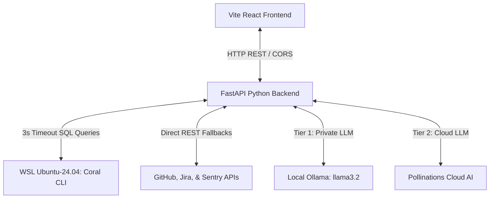

# 🌌 Team Optimization Portal (TOP)

Welcome to the **Team Optimization Portal (TOP)**—a state-of-the-art, premium developer intelligence and operations workspace. 

TOP is designed to convert complex, jargon-heavy database tables, dense application crash logs (stack traces), and developer conversations into **clear, structured, plain-English summaries**. By bridging the gap between high-level management and low-level source code, TOP empowers entire teams to stay aligned, track bottlenecks, resolve build issues, and search company history without drowning in technical noise.

TOP is powered by a high-speed Python FastAPI backend, a responsive React Vite frontend, a secure local Linux (WSL) configuration lifecycle, and a resilient multi-tier AI summary engine.

---

## 🛠️ Core Developer Suite: The Tools That Drive TOP

The dashboard comes packed with a specialized suite of premium developer tools built to optimize daily engineering operations. Here is a full-blown breakdown of each product:

### 1. ⚡ Fix Build (Failure Hunter)
* **The Problem:** When a CI/CD build breaks, developers have to dig through thousands of lines of terminal output inside GitHub Actions or Sentry crash logs to figure out which line of code caused the exception.
* **The Solution:** **Failure Hunter** automatically scans your target repository's CI/CD action runs to find build and test failures in real-time.
* **Under the Hood:** 
  * The backend queries database tables and cloud REST APIs (`github.repo_action_runs`) to fetch the latest failed workflow runs.
  * It isolates the exact failed step, commit SHA, and error log segment.
* **The User Experience:** 
  * Renders a glowing list of failed build cards, featuring the workflow title, commit author, and direct clickable links to the GitHub Actions page.
  * Parses and displays key action metrics (such as the workflow duration ⏱️, trigger event 🔄, and run number 🔢) as vibrant pills.
  * Generates an **asynchronous AI debugging drawer**: clicking it translates the cryptic compiler or test traceback (e.g., `NullPointerException` or `AssertionError`) into a plain-English explanation showing exactly *which file broke*, *why*, and *how to fix it*.

### 2. 🧹 Cleanup PRs (PR Reaper)
* **The Problem:** Pull Requests (PRs) sit in limbo waiting for review, stalling features, causing merge conflicts, and slowing down product launches. 
* **The Solution:** **PR Reaper** scans open Pull Requests to identify bottlenecks, stagnant code, or missing approvals.
* **Under the Hood:** 
  * Uses direct, multi-threaded GitHub REST API calls to evaluate open PRs against review states and commit activities concurrently.
  * It detects if a PR is stale (inactive for > 14 days) or waiting on required reviewer approvals.
* **The User Experience:**
  * Displays an elegant dashboard showcasing high-impact metric cards (e.g., *Stale PRs Found*, *Missing Approvals*) at a glance.
  * Groups stagnant PRs into beautiful grid cards. Each card highlights the PR title, author metadata, and clickable hyperlink anchor.
  * Automatically calculates review progress: parses and renders **metric pills** for review comments 💬, approved checkmarks ✅, requested reviewers, and exact submission dates.
  * Displays a glassmorphic alert callout (e.g., *"Blocked: Waiting for approval from Lead Architect"*) to guide team leads.

### 3. 📝 Handover Tool (Accomplishments & Handoffs)
* **The Problem:** Handing over a project between developers, wrapping up a sprint milestone, or compiling release notes manually takes hours of searching git logs and writing summaries.
* **The Solution:** **Handover** automatically generates professional milestone documentation and release summaries.
* **Under the Hood:**
  * Gathers all commits, pull requests, and closed issues for a target repository within the target scope.
  * Integrates the 3-Tier AI Orchestrator to distill the raw technical modifications into a comprehensive progress report.
* **The User Experience:**
  * Outputs a structured, copy-pasteable markdown document featuring three highly professional sections:
    1. **Summary of Accomplishments:** A clear timeline of features shipped.
    2. **Key Technical Changes:** Code refactors, database migrations, and structural highlights.
    3. **Handoff & Next Steps:** Open issues, remaining tasks, and suggestions for the next developer.
  * Ideal for managers compiling sprint updates or engineers transitioning tasks.

### 4. 💻 Query Console (Live SQL Playground)
* **The Problem:** Accessing raw telemetry across GitHub, Jira, and Sentry requires building custom APIs or executing heavy database lookups.
* **The Solution:** A direct, full-blown SQL playground enabling you to query your entire cloud and developer stack using standard database syntax.
* **Under the Hood:**
  * Hooks into the local Coral WSL compiler to execute queries against schemas like `github.issues`, `github.commits`, `github.pull_requests`, and `github.repo_action_runs`.
  * Integrates our **3-second fail-fast timeout and local schema redirection fallbacks**. If a heavy WSL query lags, TOP intercepts it and executes standard high-speed cloud REST API requests, mapping the variables to fully match the expected database schemas perfectly.
* **The User Experience:**
  * Includes the **Coral Schema Tree** sidebar listing all available tables and columns with clean ellipsis truncations and hover titles.
  * Double-clicking elements in the tree automatically inserts them into your query console.
  * Features a gorgeous syntax editor, custom schema badges, and tabular results panels.

---

## 🚀 Interface Tour: Dashboard Enhancements

Here is a guide to every powerful visual feature packed into your TOP dashboard:

### 1. 🔍 Unified "Debug Assistant" (Cross-Platform Search)
* **What it is:** A unified search engine for your company’s developer history—like Google Search, but for your internal codebases and operations.
* **How it works:** You type in a query (e.g., `"PostgreSQL connection pool exhausted"`), and TOP concurrently queries four completely different sources:
  1. **Sentry** (for application exceptions and crashes).
  2. **Slack** (for developer discussions and group threads).
  3. **Jira** (for engineering tasks and tickets).
  4. **GitHub** (for commits, pull requests, and codebase issues).
* **The Magic:** Instead of searching four separate browser tabs, you see all matching events in a unified, beautifully color-coded timeline.

### 2. 🧠 Resilient Triple-Tier AI Summarizer Agent
* **What it is:** A translation engine that reads cryptic logs (like `NullPointerException` stack traces) and converts them into simple, structured markdown bullet points.
* **How it works:** It displays summaries in three neat buckets:
  * **Overview:** What happened in plain terms.
  * **Key Impacts:** Who or what this issue affects (e.g., *"Users cannot log in"*).
  * **Recommended Action Items:** The exact steps to take next.
* **Triple-Tier Reliability:**
  * **Tier 1 (Private Local LLM):** Tries to run your local offline Ollama (`llama3.2`) model for complete data privacy.
  * **Tier 2 (Cloud Fallback AI):** If local Ollama is offline or loading, it instantly routes to a keyless cloud AI model using spoofed browser headers to bypass rate-limiting Cloudflare firewalls.
  * **Tier 3 (Local NLP Heuristics):** If your computer is entirely disconnected from the Internet, a built-in Python pattern-matching script takes over and structures the output. **It is guaranteed to work 100% of the time, offline and forever.**

### 3. 🎨 Interactive Dual-Tab Accordion Cards
* **What it is:** An interactive preview drawer attached to every log or search match.
* **How it works:** When you click **"View In-depth Analysis"** on a developer card, the AI explanation loads instantly in the background. Inside, you can switch seamlessly between two tabs:
  * **`✨ AI Agent Explanation`** (default): Reads the plain-English translation.
  * **`💻 Raw Developer Logs`**: Switch on-demand to see the unmodified, full-fidelity code, stack trace, or database table row.
* **State Preservation:** Every single parameter input, expand state, card output, and selected tab is cached in memory. If you toggle between different tools in the sidebar, your exact state is perfectly preserved!

### 4. 🗂️ Database Explorer (Ellipsis Truncation)
* **What it is:** A sidebar schema browser that lists all tables and columns in your active database.
* **The Visual Fix:** Extremely long database table names (such as `activity_list_repos_watched_by_user`) used to spill out of their cards and break the layout. 
* **How it works now:** Long names are now beautifully truncated with an ellipsis (`...`). Hovering your cursor over the table name triggers a clean browser-native tooltip displaying the full name instantly.

### 5. 🏷️ Scrollable Sidebar & Unclipped Premium Tooltips
* **What it is:** A fully scrollable navigation sidebar that keeps descriptive black label hover tooltips completely visible without clipping.
* **How it works now:** 
  * The sidebar container supports full vertical scrollbars (`overflow-y: auto`), meaning navigation lists remain accessible on any display height.
  * The dark slate (`#0f172a`) hover labels use `position: fixed` horizontal locks (`left: 272px` and `left: 266px`). This allows them to escape the sidebar's scroll container boundaries completely.
  * Because the navigation items use flex alignment with vertical centering, the tooltips naturally align vertically with the exact hovered item automatically.

### 6. 🔗 Global Shared Repository URL Input
* **What it is:** A shared parameter box that stays with you across the application.
* **How it works:** Enter a repository URL (or scope parameter) once, and it instantly propagates to all other tools. You can navigate between *Fix Build*, *PR Reaper*, and *Timeline* without the friction of copy-pasting the URL again and again.

---

## 🔌 Architecture Diagram



---

## 🔒 Service Connections & Privacy (Setup Tab)

### "Will my credentials be leaked if I publish this project?"
**No. Your personal tokens and base URLs are 100% private and secure.**

Here is the exact lifecycle of how your connections are managed:
1. **Input:** You paste your personal access token (along with parameters like Jira URL or Sentry Org) and click **Connect**.
2. **Browser Storage:** The values are securely cached locally in your browser's private `localStorage` (so they remain saved even if you close the tab).
3. **WSL Environment Sync:** The backend receives your token and executes a secure command inside your local Windows Subsystem for Linux (WSL) container to bind the credential to the local Coral engine:
   ```bash
   wsl -d Ubuntu-24.04 -- bash -c "GITHUB_TOKEN='your_token' /root/.local/bin/coral source add github"
   ```
4. **Local Hard Drive Only:** The configuration keys are written inside `/root/.config/coral/` in your private Linux environment. They do **not** exist in the project files.
5. **Publishing Safety:** If you share this project folder on GitHub or deploy it to a public hosting platform, **none of your keys or tokens are in the code**. Other developers who download the app will simply see a blank "Setup" page, and the application will load keys from *their* local WSL machine.

---

## 💻 Getting Started

### Prerequisites
* **Python 3.10+** (with `fastapi`, `uvicorn`, `pydantic`, `jinja2`)
* **Node.js 18+** & **npm**
* **WSL Ubuntu-24.04** with the Coral CLI installed
* **Ollama** running locally (optional, for local private AI summaries)

### Running the Application

TOP includes a convenient launcher script that fires up both the frontend and backend in unified windows:

1. **Double-click `run_all.bat`** in the project root folder.
2. The FastAPI server will fire up on `http://localhost:8000`.
3. The React Vite development server will fire up on `http://localhost:5173`.
4. Open `http://localhost:5173` in your web browser to start optimizing your team's workflow!

### Manual CLI commands
If you prefer running the components individually in your terminal:

* **Start Backend:**
  ```bash
  cd backend
  python main.py
  ```
* **Start Frontend:**
  ```bash
  cd frontend
  npm run dev
  ```
* **Run Verification Tests:**
  ```bash
  cd backend
  python test_reaper.py
  ```
